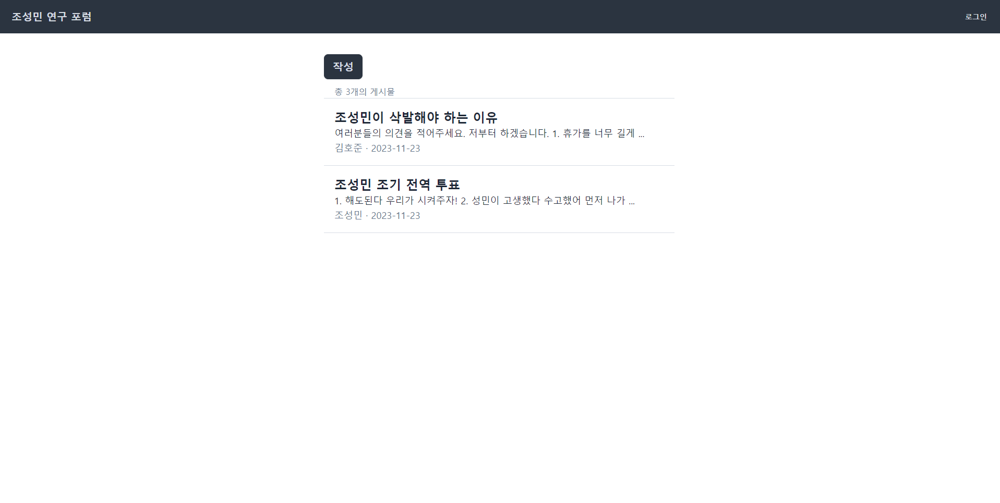
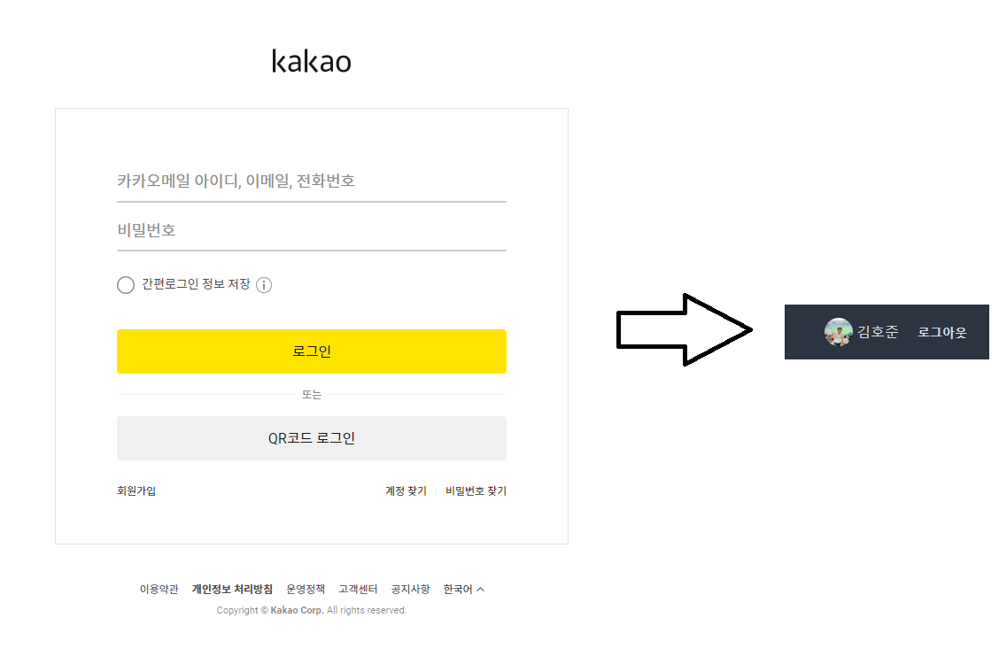
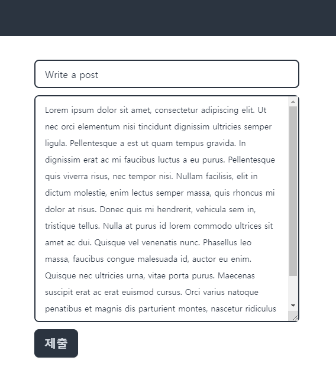
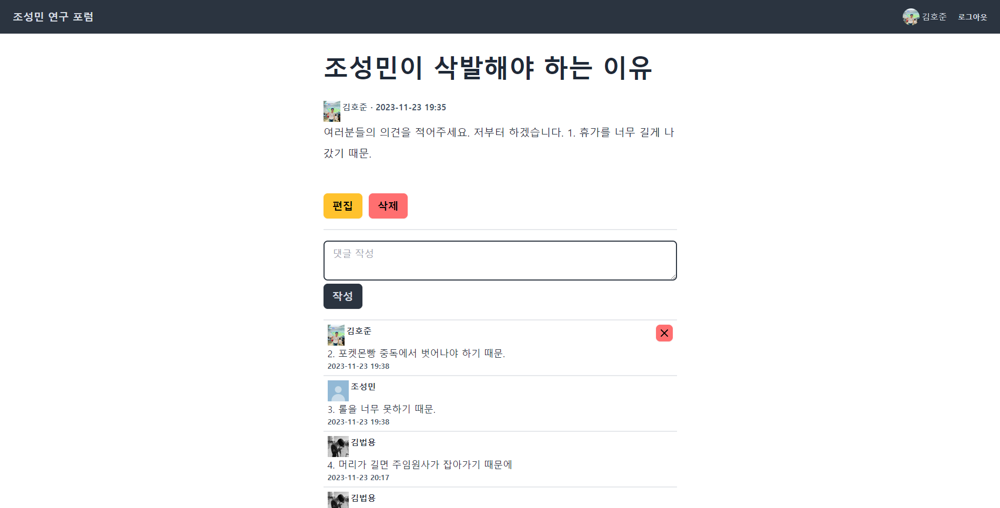
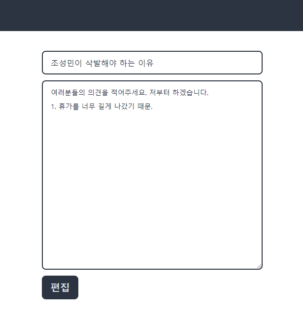

# 🎬 Forum Web

https://jindun-forum.vercel.app/

## 📚 Tech Stack

- **Database**: Vercel's PostgreSQL
- **ORM**: Prisma
- **Authentication**: Kakao login via NextAuth.js

## 💡 Features

### **Index Page**

- Displays all posts.
- Includes a button to create a new post.

### **Login Page**

- Kakao social login (name, profile picture).

### **Post Creation Page**

- Logged-in users can create posts by entering a title and content.

### **Post Page**

- Displays post details: title, content, author, and creation date/time.
- Authors can edit or delete their posts.
- Logged-in users can comment, and comment authors can delete their comments.

### **Post Edit Page**

- Only accessible by the post author.
- Allows editing of the post title and content.

## About the Project

Forum Web is a web application built with **Next.js** and **TypeScript**, designed to provide a simple and interactive forum experience. Users can log in via **Kakao** using **NextAuth.js**, create posts, and leave comments. The backend is powered by **Vercel's PostgreSQL** database, managed with **Prisma** as the ORM. The UI is styled with **TailwindCSS** and **DaisyUI** for a clean and responsive design.

### Key Learnings

- Implemented **Kakao social login** using NextAuth.js.
- Managed database interactions with **Prisma** and **PostgreSQL**.
- Built a responsive and user-friendly UI with **TailwindCSS** and **DaisyUI**.
- Gained experience in full-stack development with **Next.js** and **TypeScript**.
